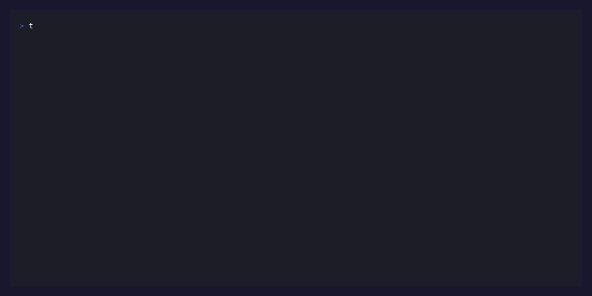

<p align="center">
  
</p>

<h1 align="center">taskmaster</h1>

<p align="center">
  <em>A fast, no nonsense CLI task manager that lives where you work — the terminal.</em>
</p>

<p align="center">
  <a href="https://github.com/PRAIZZZ-08/taskmaster/actions"></a>
  <a href="https://github.com/PRAIZZZ-08/taskmaster/releases"></a>
  <a href="https://pkg.go.dev/github.com/PRAIZZZ-08/taskmaster"></a>
  <a href="https://goreportcard.com/report/github.com/PRAIZZZ-08/taskmaster"></a>
  <a href="https://github.com/PRAIZZZ-08/taskmaster/blob/main/LICENSE"></a>
  <a href="https://golang.org/dl/"></a>
</p>

<p align="center">
  
</p>

---

## What is taskmaster?

Taskmaster is a terminal first task manager built in Go. Your tasks are stored as plain JSON — no database daemon, no cloud sync required, no account to create. It starts up instantly, does exactly what you tell it, and stays out of your way.

I built it because most todo tools are either too simple (sticky notes) or too heavy (project management suites). Taskmaster lives in the middle: a single binary that manages your list with four commands, stores data in a file you can read and version-control, and gets out of the way the moment you're done.

Tasks persist between sessions. The list is yours. No lock-in.

---

## Features

- ✅ **Add tasks** — Append a task to your list with a single command
- 📋 **List tasks** — See every pending and completed task at a glance
- ✔️ **Mark done** — Flag any task complete by its ID
- 🗑️ **Delete tasks** — Remove a task permanently by ID
- 💾 **JSON persistence** — Tasks are stored in a human-readable `tasks.json` file you can inspect, back up, or version-control
- ⚡ **Zero dependencies at runtime** — Single compiled binary, no runtime required
- 🔬 **Tested** — Core save/load logic covered by unit tests

---

## Installation

### From source (recommended)

Requires Go 1.25 or later.

```bash
git clone https://github.com/PRAIZZZ-08/taskmaster.git
cd taskmaster
go build -o taskmaster .
```

Move the binary somewhere on your `$PATH`:

```bash
mv taskmaster /usr/local/bin/
```

### With `go install`

```bash
go install github.com/PRAIZZZ-08/taskmaster@latest
```

### Verify installation

```bash
taskmaster
# Usage: taskmaster [add|list|done|delete]
```

---

## Usage

### Add a task

```bash
taskmaster add "Write unit tests for the auth module"
```

### List all tasks

```bash
taskmaster list
```

Output:

```
[ ] 1. Write unit tests for the auth module
[ ] 2. Update the deployment docs
[x] 3. Fix the login redirect bug
```

Tasks marked with `[x]` are complete. Tasks marked with `[ ]` are still pending.

### Mark a task as done

```bash
taskmaster done 1
```

### Delete a task

```bash
taskmaster delete 2
```

---

## Task Storage

All tasks are written to `tasks.json` in the current working directory. The format is human-readable:

```json
[
  {
    "id": 1,
    "description": "Write unit tests for the auth module",
    "is_done": true
  },
  {
    "id": 2,
    "description": "Update the deployment docs",
    "is_done": false
  }
]
```

You can commit this file to version control, copy it between machines, or edit it manually if needed. Taskmaster will read it back correctly on next run.

---

## Configuration

No configuration file is required. Taskmaster uses a single constant for the task file path (`tasks.json`) defined in `main.go`. To change the storage location, rebuild with a modified `taskFile` constant, or point your shell alias to a wrapper that changes directory first.

---

## Running Tests

```bash
go test ./...
```

Tests cover the core persistence layer — saving tasks to disk and loading them back correctly, including error handling for missing files.

```
?       github.com/PRAIZZZ-08/taskmaster        [no test files]
ok      github.com/PRAIZZZ-08/taskmaster/todo   0.004s
```

---

## Project Structure

```
taskmaster/
 ├── assets/
 │   └── banner.png # README banner
 ├── demo.gif # Recorded terminal walkthrough, embedded above
 ├── demo.tape # VHS script that generates demo.gif
 ├── go.mod
 ├── LICENSE
 ├── main.go # CLI entry point and command routing
 ├── README.md
 ├── taskmaster # Compiled binary (gitignored, produced by `go build`)
 ├── tasks.json # Runtime task storage (gitignored, created on first add)
 └── todo
     ├── task.go # Task struct, SaveTasks, LoadTasks
     ├── task_test.go # Unit tests for persistence layer
     └── test_tasks.json # Fixture used by tests
```

---

## Regenerating the Demo

The terminal recording at the top of this README is generated with [VHS](https://github.com/charmbracelet/vhs) from the script in `demo.tape`. If you change the CLI's commands or output, regenerate the recording so the README stays accurate:

```bash
go build -o taskmaster .
vhs demo.tape
```

This produces a fresh `demo.gif` in the repo root. VHS needs a few things on your machine to run: [ttyd](https://github.com/tsl0922/ttyd), `ffmpeg`, and a Chromium-based browser (VHS drives a headless browser to render the recording). See the [VHS installation docs](https://github.com/charmbracelet/vhs#installation) for setup instructions per platform.

---

## Contributing

Pull requests are welcome. For significant changes, open an issue first to discuss what you'd like to change.

1. Fork the repo
2. Create a feature branch: `git checkout -b feat/my-feature`
3. Commit your changes: `git commit -m "feat: add my feature"`
4. Push and open a pull request

Please update tests as needed.

---

## License

MIT © [Pamilerin Sodeke](https://github.com/PRAIZZZ-08)
